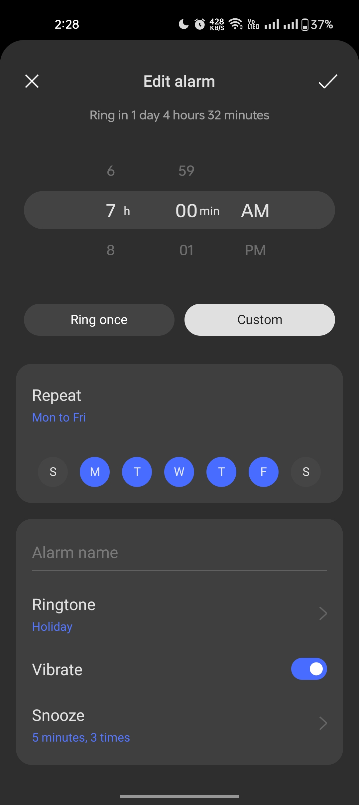

# Time Picker

Time Picker inspired by Oppo Clock app set alram time screen with full customization

## Features

* Easy to use
* Fully customizable

## Getting started

```yaml
dependencies:
  ...

  time_picker_wheel: <version>

```

## Usage

```dart
import 'package:time_picker_wheel/time_picker_wheel.dart';
```

Defualt style

```dart
TimePicker()
```

Customize style

```dart
TimePicker(
    options: TimePickerOptions.byDefault(
    height: 200,
    itemExtent: 30,
    diameterRatio: 1,
    selectedRowHeight: 70,
    fontOpacity: 1,
    fontColor: Colors.purple,
    labelSize: 25,
    numberSize: 25,
    amPmSize: 15,
    amPmWidth: 25,
    wheelWidth: 50,
    selectedRowHorizontalPadding: double.maxFinite,
    selectedRowHorizontalBorderRadius: 0,
    selectedRowForegroundColor: Colors.black,
    selectedRowBackgroundColor: Colors.amber,
    ),
)
```

## Screenshot

Example                             |  Inspired from Oppo clock app set salram screen
:----------------------------------:|:------------------------------------------------------------:
 | 
